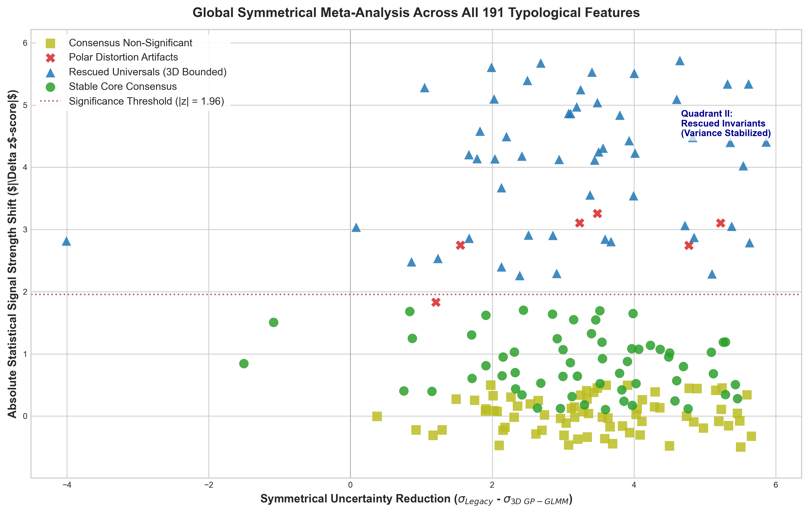
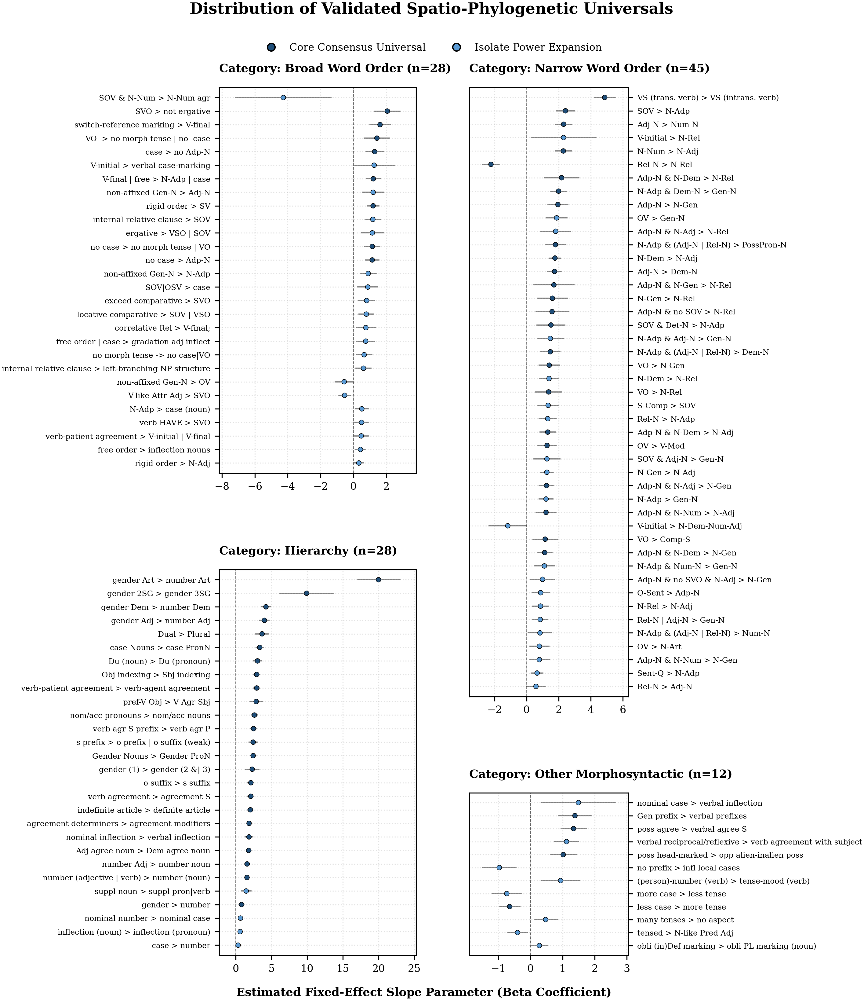

# Constraints that endure: Assessing model robustness in linguistic typology

This repository contains the code and data tables used to reanalyze the cross-linguistic universals framework from Verkerk et al. (2026).

The current architecture implements a series of 3D spatial Gaussian Process Generalized Linear Mixed Models (GP-GLMM). This architecture fixes boundary errors for historically isolated languages, revealing where universal constraints were hidden by parameter collapse/explosion in the original Bayesian model.

## Repository Overview

```text
├── output/
│   ├── feature_synthesis/                  # combined results for each linguistic feature
│   ├── global_isolate_comparisons/         # broad map visual of all languages (per feature)
│   ├── isolate_comparisons/                # comparison plots for isolated languages
│   ├── model_predictions_2d/               # 2D coord model summaries (Parquet format)
│   ├── model_predictions_3d/               # 3D coord model summaries (Parquet format)
│   │
│   ├── global_synthesis_scatter.png        # comparison scatter plot for all universals
│   ├── GPGLMM_results_191_100tree-2d.xlsx  # summary metrics for 2D coord model
│   ├── GPGLMM_results_191_100tree-3d.xlsx  # summary metrics for 3D coord model
│   ├── Results_3D_Master_Synthesis.xlsx    # main data sheet sorting features into 5 groups
│   ├── Supplementary_Table_S1_Global..xlsx # full supplementary data sheet
│   ├── Table_A_Consensus.xlsx              # universals confirmed by all models
│   ├── Table_B_Expansion.xlsx              # new universals found by this model
│   ├── universals_forest_plot.pdf          # forest plot pdf
│   └── universals_forest_plot.png          # forest plot graphic
├── tlu/                                    # raw data (in subfolders) from the original study (coded features + trees)
│   ├── BT_results_summary.txt              # original datasheet (corrected 'bmrs' column typos to 'brms')
│   └── Glottolog_Languages.csv             # summary glottolog language sheet from the original study
├── utils/
│   ├── check_datasets.py                   # data integrity check before running models
│   ├── diagnostic_master.py                # main script sorting data into matching groups
│   ├── gpglmm_engine.py                    # core modeling script
│   └── plotting_master.py                  # generates all charts and forest plots
├── .gitignore
├── README.md                               # project documentation
├── requirements.txt                        # pinned package dependencies
└── run_gpglmm.py                           # main script
```

## Background & data sources

The original study used a series of Bayesian MCMC spatiophylogenetic models (including language family, macroarea, 2D longitude/latitude spatial coordinates, and 100 posterior phylogenetic trees) via `brms` in R to evaluate support for 191 binary-coded universals based on data from Grambank. They found support for 89 universals, which were then processed through an evolutionary co-evolution analysis via `BayesTraits` to yield a final confirmed set of 60 language universals.

* **Original Paper:** Verkerk, A., Shcherbakova, O., Haynie, H.J., Skirgård, H., Rzymski, C., Atkinson, Q.D., Greenhill, S.J., & Gray, R.D. 2026. Enduring constraints on grammar revealed by Bayesian spatiophylogenetic analyses. *Nat Hum Behav* 10, 126–136. https://doi.org/10.1038/s41562-025-02325-z.
* **Data Source:** The original study dataset and code are available at [TestingLinguisticUniversals](https://github.com/SimonGreenhill/TestingLinguisticUniversals).

### Key differences in this version
The replication framework replaces the original block structure with an automated pipeline that alters how geographic boundaries and isolated lineages are evaluated:

| Architectural Component | Original Study Engine (`brms` + `BayesTraits`) | Replicated Pipeline Engine (`gpboost` in Python) |
| :--- | :--- | :--- |
| **Statistical Framework** | Bayesian spatiophylogenetic MCMC estimation. | Frequentist Gaussian Process Generalized Linear Mixed Model (GP-GLMM). |
| **Spatial Projections** | Flat 2D longitude/latitude map coordinates. | Continuous 3D spatial matrix coordinate mapping. |
| **Isolate Variance Tracking** | Pooled parameters (prone to trace collapse or explosion). | Explicit routing for language isolates to isolate localized variance profiles. |

By separating out language isolates as independent variance tracks, this framework prevents parameter collapse or explosion during estimation. The distinct visual differences in how these two architectural frameworks handle isolated language data points can be examined directly in `output/isolate_comparisons` and `output/global_isolate_comparisons`, which compares the current model's variance profiles with the MCMC traces from the original study using the synthesis records stored under `output/feature_synthesis`.

## Results of the replication

### Cross-framework comparison
This scatter plot maps out where the GP-GLMM agrees or disagrees with the previous method across all 191 linguistic features. Features are spaced out horizontally by how much the current model reduced background uncertainty, and grouped into distinct vertical rows so the different categories don't overlap and blur together:



*   **Stable Core Consensus (Deep Blue Circles):** 60 features confidently confirmed by both old and new modeling approaches.
*   **Rescued Universals (brms + gpglmm) (Royal Blue Triangles):** 28 intermediate features saved after the original study's final checks dropped them.
*   **Rescued Universals (gpglmm Alone) (Cyan Triangles):** 25 brand-new universal rules discovered exclusively by the GP-GLMM.
*   **Projection Shift Artifacts (Crimson Red Crosses):** Features that looked like true universals on flat maps but were proven to be geographical side effects by GP-GLMM.
*   **Consensus Non-Significant (Muted Yellow Squares):** Background traits where all models agree there is no meaningful pattern.

### Distribution of validated universals
The forest plot displays estimated model effects (\(\beta\) coefficients) and 95% confidence intervals for all 113 confirmed universals, split by language domain and color-coded to match final groups:



## How to run the replication

The 3D spatial mixed models use the `gpboost` library's Gaussian Process and mixed-effects modes to handle language isolate variance structures. The tree-boosting functionality is not used in these models.

### Dependencies
Install the required packages using the pinned project requirements file:
```bash
pip install -r requirements.txt
```

### 1. Fit the frequentist model
Run the core pipeline script to validate the data structures, build the GP-GLMMs via `gpboost`, and export the raw trajectory parameters:
```bash
python run_gpglmm.py
```

### 2. Compare the frameworks
Run the tracking diagnostic script to aggregate the GP-GLMM outputs with the original study's metrics and sort all 191 features into their final consensus groups:
```bash
python utils/diagnostic_master.py
```

### 3. Generate charts
Run the master plotting script to recreate the final visual assets, including the global framework comparison scatter plot and the distribution forest plots:
```bash
python utils/plotting_master.py
```

### Additional script explanations:
- **Validation (`utils/check_datasets.py`):** Checks the raw data files in `tlu/` to make sure there are no formatting or structural errors before modeling.
- **Modeling Engine (`utils/gpglmm_engine.py`):** Runs the main GP-GLMMs. *Note: Large output files are saved as compact binary Parquet files in `output/model_predictions_3d/` to save space. Combined results from both the current model and the original study's brms outputs are saved in `output/feature_synthesis/` as CSV files.*
