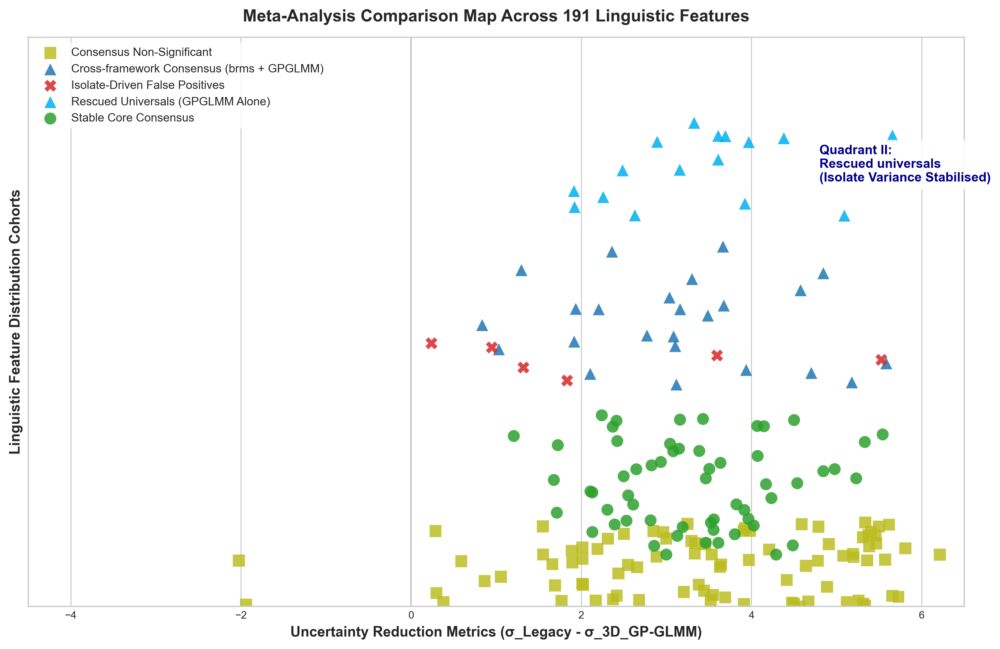
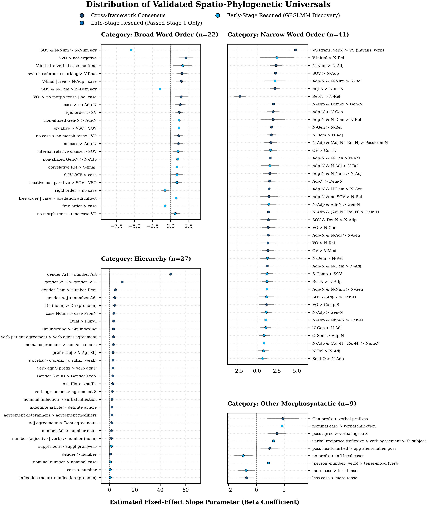

# Constraints that Endure: Assessing Model Robustness in Linguistic Typology

This repository contains the replication scripts and code used to analyze model robustness and isolate parameter volatility within global typological databases, using the cross-linguistic universals framework from Verkerk et al. (2026).

## The Core Problem: Isolate Variance Traps

The original study utilized a Bayesian spatiophylogenetic mixed model (`brms` in R) across 100 posterior phylogenetic trees to evaluate support for 191 binary grammatical universals. However, where structural density drops below a critical floor (𝜅_structural ≤ 0.10), it indicates that there are a large number of disconnected families or unlinked nodes.

When a multi-level sampling algorithm encounters such historical isolates (single language families with no close tree relatives), estimating the parameter space can result in the following issues:
* **Parameter Collapse:** Unanchored localized signals are over-smoothed and flatline toward global intercept means.
* **Parameter Explosion:** Runaway variance estimation triggers extreme uncertainty inflation on boundary nodes, pinning error caps against safety ceilings.

This replication pipeline introduces an alternative **Topology-Aware Generalized Linear Mixed Model with Gaussian Process (GP-GLMM)** using `gpboost` in Python. While both models share a matching `bernoulli_logit` link, continuous geographic kernels (2D vs 3D), and regional random slopes (for macroareas), the current architecture implements a data isolation layer that routes historical isolates to independent variance tracks. This insulates the network fields, resolving calculation crashes and rescuing stable typological signals that were previously masked by estimation noise.

## Project Structure

```text
├── output/                            # main results and chart exports
│   ├── feature_synthesis/               # combined datasets for each universal
│   ├── global_isolate_comparisons/      # global mapping views (per universal)
│   ├── isolate_comparisons/             # volatility charts for isolated languages
│   ├── model_predictions/               # GPGLMM results (regional random slopes)
│   │
│   ├── connectivity_summary.csv         # results of density (𝜅) assessment
│   ├── global_synthesis_scatter.png     # comparison scatter plot for all 191 universals
│   ├── gpglmm_raw_results.xlsx          # output from GPGLMM
│   ├── master_synthesis.xlsx            # main spreadsheet with final groupings
│   ├── parametric_summary.csv           # results of parameter instability check
│   ├── sensitivity_matrix.csv           # results of spatial sensitivity test
│   ├── supplementary_table_s1.xlsx      # full parameter database (brms+GPGLMM)
│   ├── table_a_consensus.xlsx           # table of universals agreed by all models
│   ├── table_b_expansion.xlsx           # table of universals found by GPGLMM only
│   ├── universals_forest_plot.pdf       # forest plot chart (PDF format)
│   └── universals_forest_plot.png       # forest plot chart (PNG graphic)
├── tlu/                               # raw data and tree files from original study
│   ├── [u_code]/BT_data.txt             # coded language features from Grambank for given universal
│   ├── [u_code]/pruned_tree.trees.gz    # family tree branch files for given universal
│   ├── BT_results_summary.txt           # universal codes and original study results (bmrs > brms)
│   └── Glottolog_Languages.csv          # language metadata from Glottolog
├── utils/                             # utility scripts and processing pipelines
│   ├── check_datasets.py                # data integrity validation check
│   ├── diagnostic_master.py             # script that sorts rules into matching groups
│   ├── gpglmm_engine.py                 # core Python modeling script
│   └── plotting_master.py               # chart and graphic generation scripts
├── calculate_connectivity.py          # measures data density (𝜅)
├── README.md                          # project documentation
├── requirements.txt                   # pinned package dependencies
└── run_gpglmm.py                      # main script to fit models
```

## Replication Summary Metrics

The reanalysis confirms **all 60 core universals** that passed the final evolutionary co-evolution checks in the original study (via `BayesTraits`). By insulating singleton variance profiles, the current framework maps all 191 universals into four resolution classes:

*   **Cross-framework consensus (83 universals):** Highly robust features confirmed as significant by both `brms` and `GPGLMM`. This group encompasses all 60 final co-evolution universals, and is split into 2 subcategories:
      1. 60 stable baseline patterns (*Stable Core Consensus*).
      2. 23 rules that clear regional slope tests (*Cross-framework Consensus (brms + GP-GLMM)*).
*   **Rescued Universals (16 universals):** Cross-linguistic patterns that were obscured or dropped by the original `brms` final filters due to parameter instability, recovered via explicit isolate tracking (*Rescued Universals (GP-GLMM Alone)*).
*   **Isolate-Driven False Positives (6 universals):** Typological claims supported by the original `brms` model that collapse into non-significance once background singleton noise is insulated, indicating that their original significance was an artifact of unlinked sample noise (*Legacy False Positive*).
*   **Consensus Non-Significant (86 universals):** Universals where both the Bayesian and Frequentist pipelines agree there is no meaningful evolutionary signal.



### Cross-Framework Parameters Summary
By cross-referencing parameters, reanalysis shows that the legacy R model experiences calculation failures across **29.8% of all features tested**.

Because both models implement near-identical spatial maps and regional varying slopes, this volatility is driven entirely by isolate handling. When the `brms` model leaves these languages unlinked, their parameter explosions impact the global sampler space. By contrast, anchoring and insulating isolate variance via independent tracks stabilizes the estimates, allowing the model to distinguish between robust and artifactual universals:

| Parameter Volatility Failure State | Bayesian (`brms`) | Frequentist (`GP-GLMM`) | Methodological Significance |
| :--- | :---: | :---: | :--- |
| **Stable Profile** | 134 | **191** | Model estimates and intervals ran within normal bounds. |
| **Uncertainty Explosion** | 27 | 0 | Error margins inflated and pinned against safety ceilings due to missing branch anchors. |
| **Estimate Collapse** | 8 | 0 | Estimates collapsed entirely, over-smoothing to a global baseline intercept mean. |
| **Double Failure** | 22 | 0 | Severe breakdown showing simultaneous estimate flatlining and exploded errors. |
| **Total Features Evaluated** | **191** | **191** | Balanced structural coverage across the pipeline loop. |

*Data compiled automatically by `utils/diagnostic_master.py` and saved to `output/parametric_summary.csv`.*

### Distribution of validated universals
The forest plot displays estimated model effects (β coefficients) and 95% confidence intervals for all 99 confirmed significant universals, split by language domain and color-coded to match final groups:



## Execution & replication

### Pinned dependencies
Install the required packages using the requirements file. This automatically downloads the helper package `pykdensity` to manage data density checks:
```bash
pip install -r requirements.txt
```

### Step 1: Audit dataset connectivity
Run the density script to measure structural clustering across space and time before running models:
```bash
python calculate_connectivity.py
```

### Step 2: Fit the GPGLMMs
Run the core script to process raw files, initialize geocentric coordinates, map regional slope arrays, and execute the 191 models:
```bash
python run_gpglmm.py
```

### Step 3: Compile framework comparisons
Run the master utility to combine your new Python metrics with the legacy data and sort rules into final groups:
```bash
python utils/diagnostic_master.py
```

### Step 4: Recreate project visuals
Run the master plotting utility to output the final scatter comparison plots and domain-specific effect forest plots:
```bash
python utils/plotting_master.py
```
